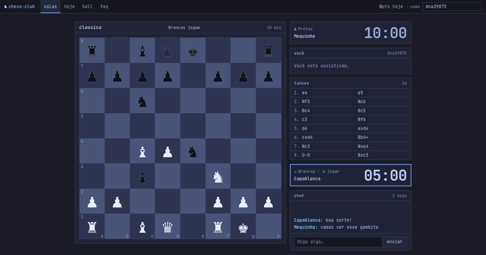
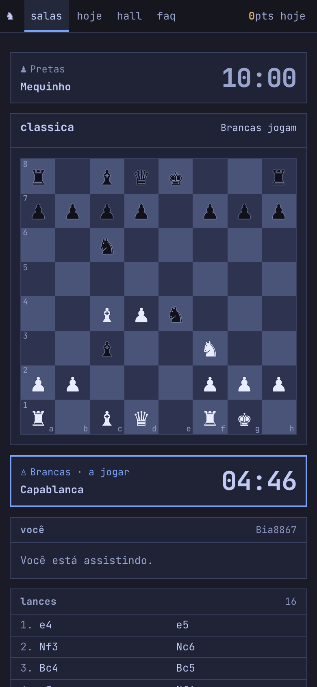
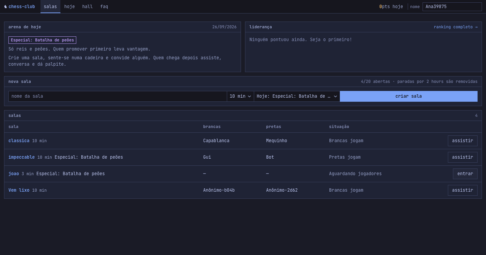
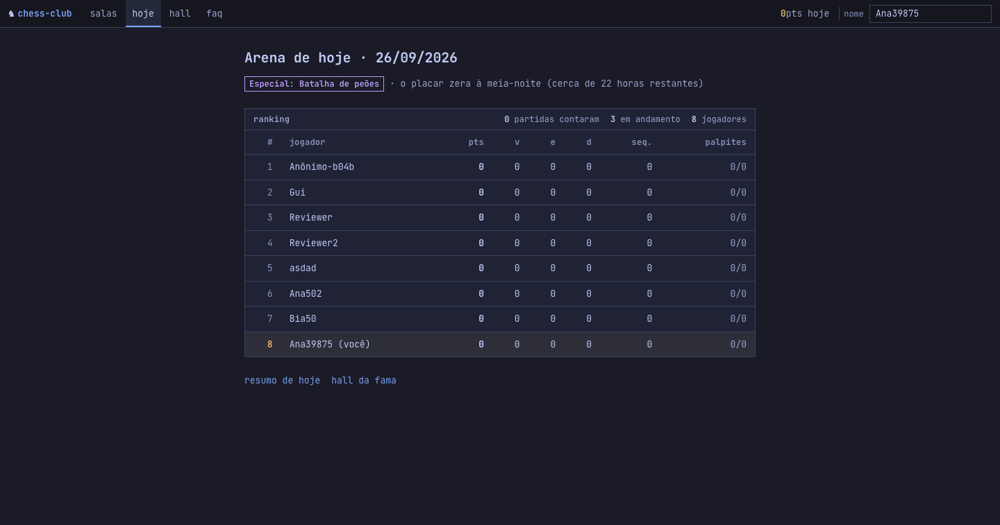
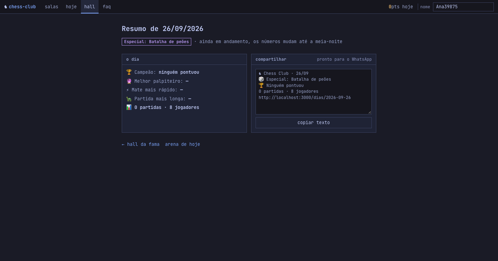

# ♞ Chess Club

Online chess rooms with a daily arena. Each room has one board, two players, any number
of spectators and a chat, all updated in real time. No sign-up, no login: you pick a
name for the day and play. At midnight (Brasília) the ranking resets and the day's
champion goes into the hall of fame.

A hobby project, built to be small and legible: Rails renders everything, htmx drives the
interaction, and the whole UI is one hand-written stylesheet.



<p align="center">
  
  &nbsp;&nbsp;
  
</p>

## What it does

- **Rooms.** Create a room, sit on a chair, share the link. Whoever arrives later watches,
  chats and guesses the winner. Every rule is enforced on the server by the
  [chess](https://github.com/pioz/chess) gem: legal moves, castling, en passant,
  promotion, checkmate, stalemate, the 50-move rule and threefold repetition.
- **Clocks.** 3 to 15 minutes per side, no increment. Time is charged on the server on
  every move; the browser only counts down between refreshes, and the first client that
  sees a clock hit zero asks the server to flag the game.
- **The daily arena.** Win 3, draw 1, +1 per win from the third consecutive win, +2 for
  beating the current leader (the crown next to a name). Resignations and draws only
  count after 10 moves; checkmate always counts. At most 3 games a day between the same
  two players count.
- **Spectators score too.** Anyone watching can predict the winner until move 10. A
  correct guess is worth a point, so the ranking mixes players and fans.
- **Theme of the day.** Wednesdays start from an opening of the day, Saturdays use a
  special position (no queens, or kings and pawns only). The day's theme is the default
  when you create a room, but any theme can be picked.
- **`/hoje`, `/dias/:date`, `/hall`.** Today's ranking, a day's recap with a text ready
  to paste into WhatsApp, and the hall of fame (one champion per day).
- **`/faq`** for the rules, **`/admin`** (HTTP Basic) to list rooms, clear chats and run
  the cleanup and close-day jobs by hand.

<p align="center">
  
  &nbsp;&nbsp;
  
</p>

## Stack

- **Rails 8.1** with the Solid trifecta in production: Solid Cache (rate limiting),
  Solid Queue (room cleanup, closing the day) and Solid Cable (WebSockets), all on SQLite.
- **htmx** for every interaction: selecting a piece, moving, taking a seat, chat, polling
  the room list and the ranking.
- **Hotwire Turbo Streams** only for server push over Action Cable. Turbo Drive is
  disabled so it does not fight with htmx.
- **Stimulus** for four small things: running `htmx.process()` on HTML inserted by Turbo,
  counting the clocks down, keeping the chat scrolled and copying the share text.
- **One stylesheet, no framework** (`app/assets/stylesheets/application.css`). No
  Tailwind, no build step; importmap and Propshaft serve everything. JetBrains Mono is the
  only web font.
- The **chess** gem for the rules.

## Design

The UI is a tiling-window-manager workspace in the [Tokyo Night](https://github.com/enkia/tokyo-night-vscode-theme)
palette, in the spirit of [Omarchy](https://omarchy.org): a blue-night ground, panes with
1px hairlines and equal 12px gaps, zero border radius, no shadows, JetBrains Mono for
everything including the clock digits (tabular numerals). The pane of the side to move
carries the "active window" border, blue for white and orange for black, and the border
jumps between the two clock panes on every move. `DESIGN.md` records the tokens and rules
so new screens stay on-brand; `PRODUCT.md` records who the product is for.

## How real time works

1. Every action (`POST /rooms/:slug/moves`, `seat`, `resignation`, `prediction`) responds
   to the caller with the `rooms/_state` partial: the board plus htmx out-of-band panels
   (`#game_info` with the clocks and moves, `#me` with the controls, `#flash`).
2. The server then calls `room.broadcast_refresh`, which pushes a `<div id="refresh">`
   with `hx-get=".../state" hx-trigger="load"` through Turbo Streams.
3. The `htmx` Stimulus controller runs `htmx.process()` on that node, htmx issues the
   GET, and every client receives **its own** view of the room (board flipped for black,
   squares only clickable on your turn, seat buttons only for spectators).
4. Chat messages use `broadcast_append_to room` directly from the model.

## Identity and limits (without accounts)

- Each browser gets a random `player_token` in the encrypted session cookie. Players
  enroll for the day with a name that is unique for that day (first come, first served);
  returning visitors are re-enrolled automatically while their name is free.
- Global limits live in `app/models/room.rb`: at most `MAX_OPEN_ROOMS` open rooms, one
  open room per creator, `MAX_MESSAGES` chat messages per room. Rooms idle for
  `STALE_AFTER` (or finished more than `FINISHED_TTL` ago) are removed by `RoomCleanupJob`.
- Rate limiting uses Rails' built-in `rate_limit` (per IP) on room creation, seats, moves,
  chat, nicknames and the admin area. 429 responses land in `#flash` through an htmx
  out-of-band swap.
- `ArenaCloseJob` runs just after midnight (`config/recurring.yml`) and writes the
  `Champion` row for the previous day.

## Decisions

- **htmx instead of Turbo Frames.** Every board interaction is "click, get a fresh board
  back". htmx expresses that in HTML attributes; Turbo is kept only for the WebSocket push,
  where it shines.
- **Refresh signal, not state broadcast.** The server broadcasts "something changed" and
  each client fetches its own view. One broadcast, no per-viewer rendering on the server,
  and the viewer-specific bits (flipped board, whose turn) stay trivially correct.
- **Rules and clocks on the server.** The browser never knows chess rules or the true
  clock; it only paints. That keeps the JavaScript at four tiny controllers.
- **Days, not accounts.** Nicknames, points, streaks and predictions belong to a single
  day. No passwords, no ratings history, nothing to leak, and every day is a fresh start.
- **Chess960 is out** because the rules gem does not implement 960 castling.
- **Portuguese UI, English code and commits.** The players are Brazilian; the codebase is
  for anyone.

## Running

```sh
bundle install
bin/rails db:prepare
bin/dev            # http://localhost:3000
bin/rails test
```

In development Action Cable uses the in-process `async` adapter and the cache is
in-memory, so real time and rate limiting work out of the box. Broadcasts fired from
outside the server process (console, runner) do not reach the browser in development;
in production, with Solid Cable, they do.

### Production

- `ADMIN_PASSWORD` is required (and `ADMIN_USER`, default `admin`), otherwise `/admin`
  stays locked.
- Run `bin/jobs` (Solid Queue) next to the web process so rooms get cleaned up and the
  day gets closed at midnight.
- `config.time_zone` is Brasília; the day rollover and the theme of the day depend on it.
- A `Dockerfile` is included.
